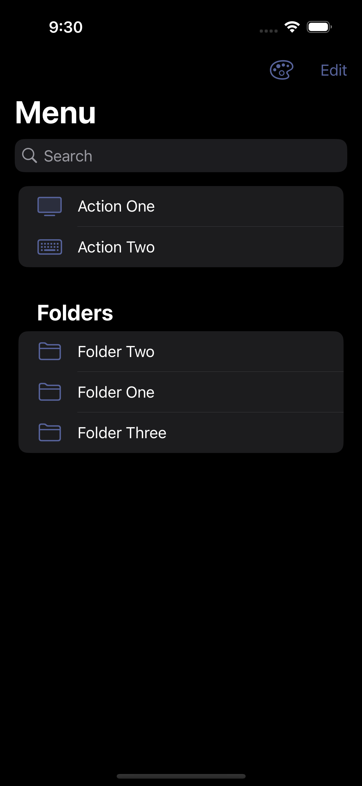
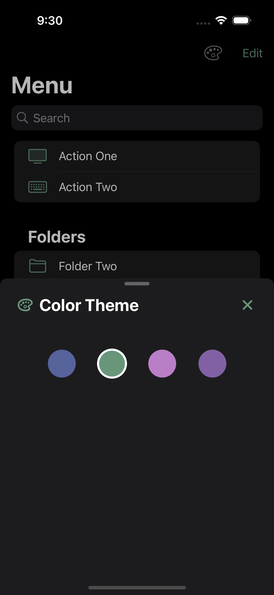
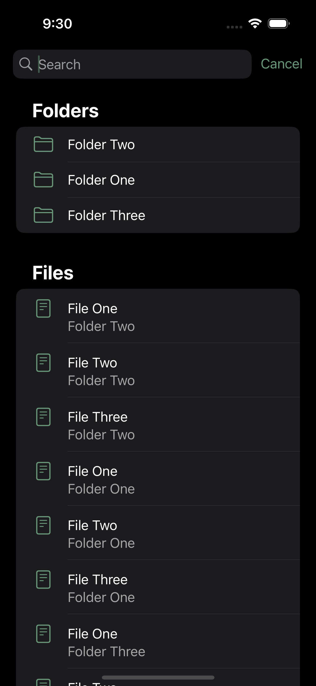
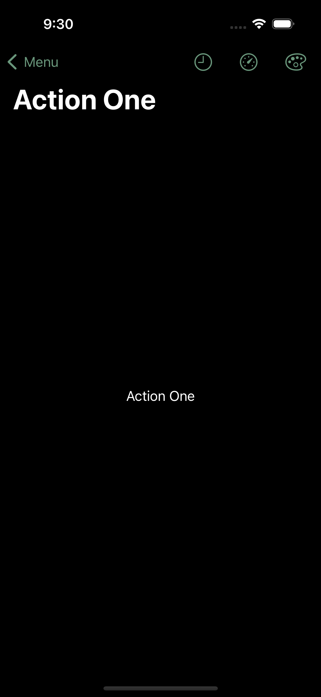

# MenuSwiftUIApp

MenuSwiftUIApp is a multi-page app built in SwiftUI. It utilizes the Coordinator pattern, has search functionality, and color theme selection.  
 
App is currently under construction
 
## To Use:
No special requirements for running the app at this time.
 
 

 
Copyright (C) 2025 Lisa Fellows
 
MenuSwiftUIApp cannot be copied and/or distributed without express permission.
